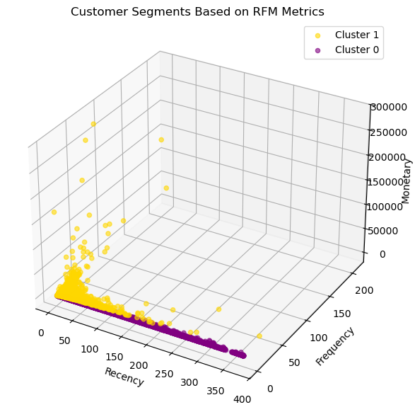
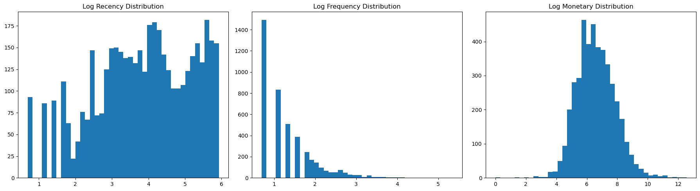
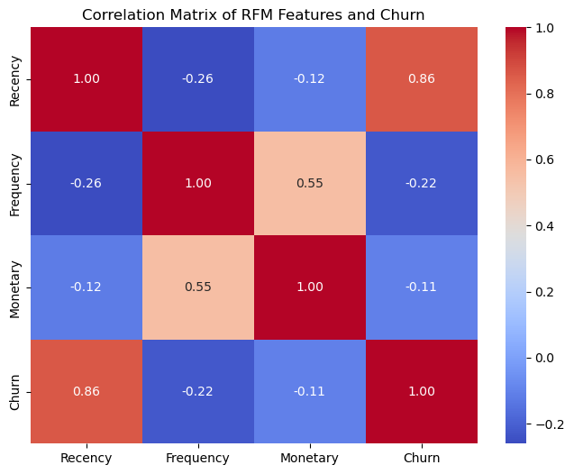
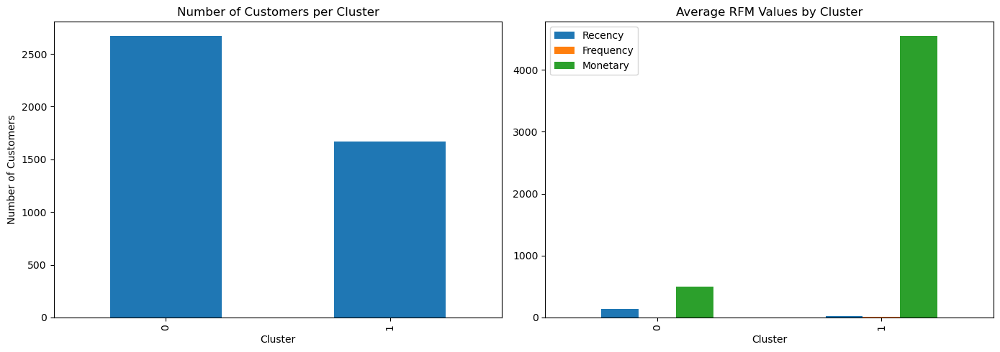
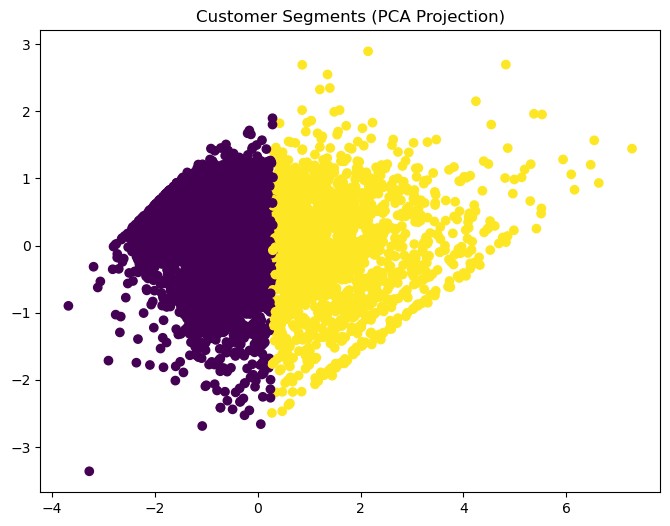
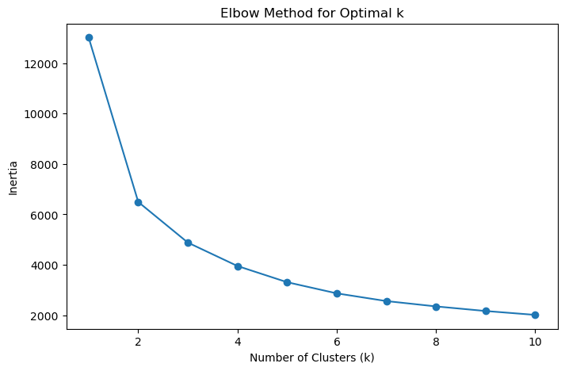
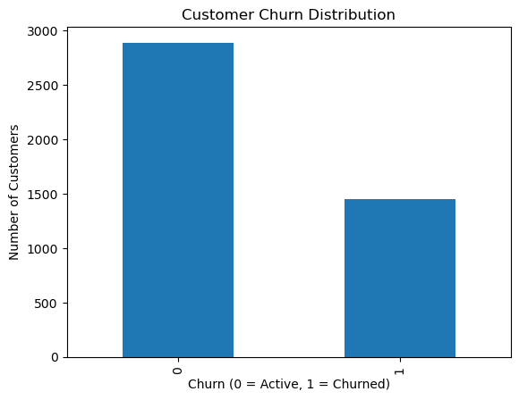
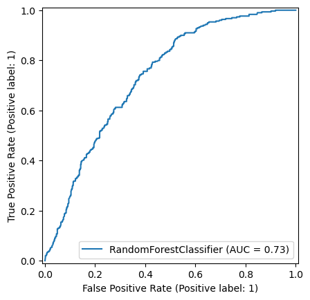
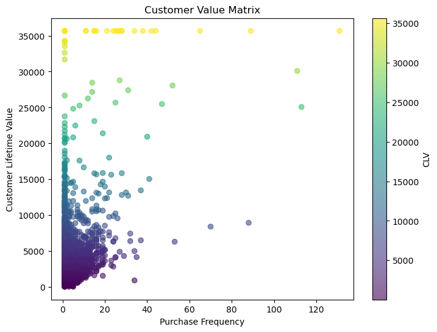

# **`CONSUMER BEHAVIOR ANALYTICS USING TRANSACTION DATA`**
## **`PROJECT OVERVIEW`**

This project analyzes customer purchasing behavior to estimate Customer Lifetime Value (CLV) using transactional data. By modeling customer purchase patterns, the study predicts the expected number of future purchases and the potential revenue each customer may generate.

The analysis applies probabilistic customer behavior models widely used in customer analytics and marketing science.

## **`METHODOLOGY`**

The analysis followed a structured data analytics workflow consisting of data preparation, exploratory analysis, machine learning, and customer value estimation.

### **`1. Data Collection`**

The study used the UCI Online Retail II Dataset, which contains transactional records of an online retail store. The dataset includes customer purchases from December 2010 to December 2011 and contains information such as invoice numbers, product descriptions, quantities purchased, transaction dates, prices, and customer identifiers.
### `2. Data Preparation`

Data preprocessing was performed to ensure the dataset was suitable for analysis.

The following steps were carried out:

- Removal of cancelled transactions (Invoices beginning with C)
- Removal of records with missing Customer ID
- Creation of TotalPrice (Quantity × Price)
- Conversion of invoice dates to datetime format
- Aggregation of transactions into customer-level features

Customer-level features were derived using RFM analysis, which includes:

- Recency – number of days since a customer’s last purchase

- Frequency – number of unique transactions made by the customer

- Monetary – total amount spent by the customer

## `3. Exploratory Data Analysis (EDA)`

Exploratory analysis was conducted to understand customer purchasing patterns and data distribution.

This included:

#### `a. Distribution analysis of Recency, Frequency, and Monetary values`

#### `b. Skewness analysis and log transformations`

#### `c. Correlation analysis using a heatmap` 

#### `d. Visualization of customer behavior patterns`

## `4. Customer Segmentation`

Customer segmentation was performed using RFM features.

The features were standardized and clustered using the K-Means Clustering algorithm.

To determine the optimal number of clusters:

- The Silhouette Score was evaluated for multiple values of K

- The value with the highest score was selected

Customers were then grouped into clusters representing different behavioral segments such as high-value and low-value customers.
## `5. Churn Prediction`

Customer churn prediction was formulated as a binary classification problem, where customers were labeled as churned or active based on their recency.

Machine learning models were trained and evaluated, including:

- Logistic Regression

- Random Forest

- Gradient Boosting

Model performance was evaluated using:

- Accuracy
- Precision
- Recall
- F1-score
- Confusion Matrix
- ROC Curve

## `6. Customer Lifetime Value (CLV) Estimation`

Customer Lifetime Value was estimated using probabilistic models implemented in the Lifetimes Python Library.

Two models were applied:

- BG/NBD Model to predict future purchase frequency

- Gamma-Gamma Model to estimate expected average monetary value

These models were used to estimate the expected future purchases and monetary value of each customer, allowing calculation of predicted CLV.

## `7. Tools and Technologies Used`

- Python

- Pandas

- NumPy

- Matplotlib

- Seaborn

- imblearn

- Lifetimes

- Jupyter 

## `8. Conclusion`

This project demonstrates how transactional data can be used to estimate Customer Lifetime Value (CLV) using probabilistic models. By combining RFM analysis with predictive models such as the BG/NBD Model and the Gamma-Gamma Model, businesses can forecast future purchasing behavior and estimate the long-term value of customers.

Understanding customer value allows organizations to develop more effective marketing strategies, improve customer retention, and maximize long-term revenue.